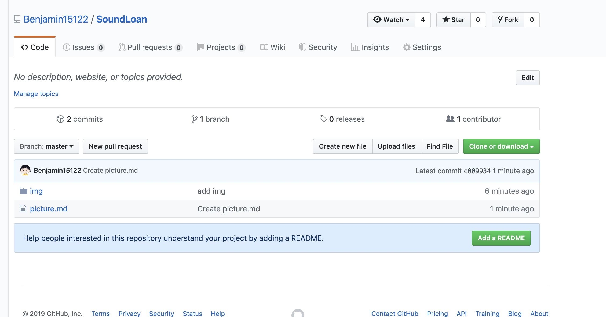
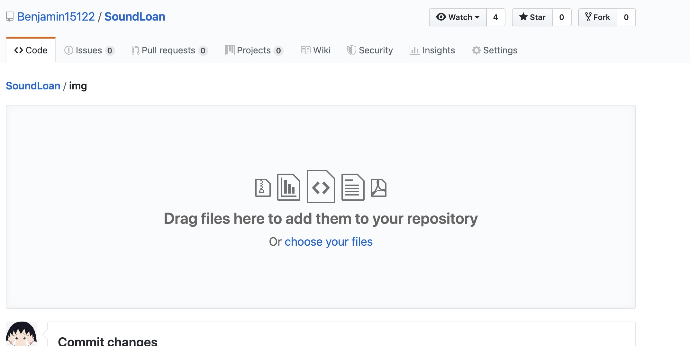
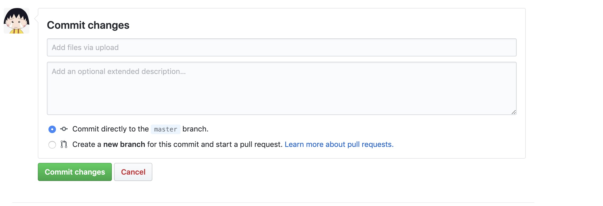
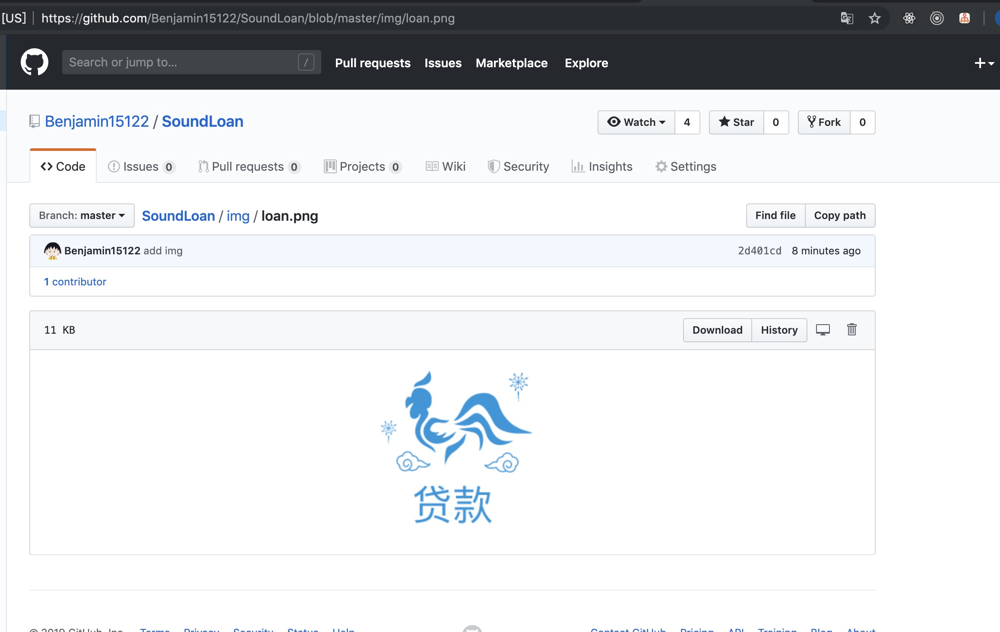
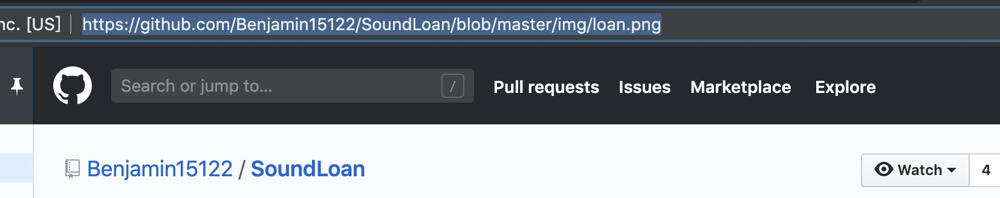
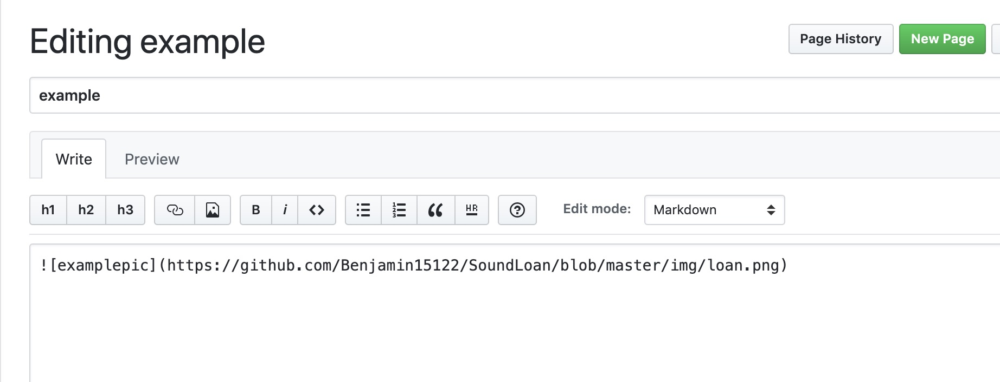
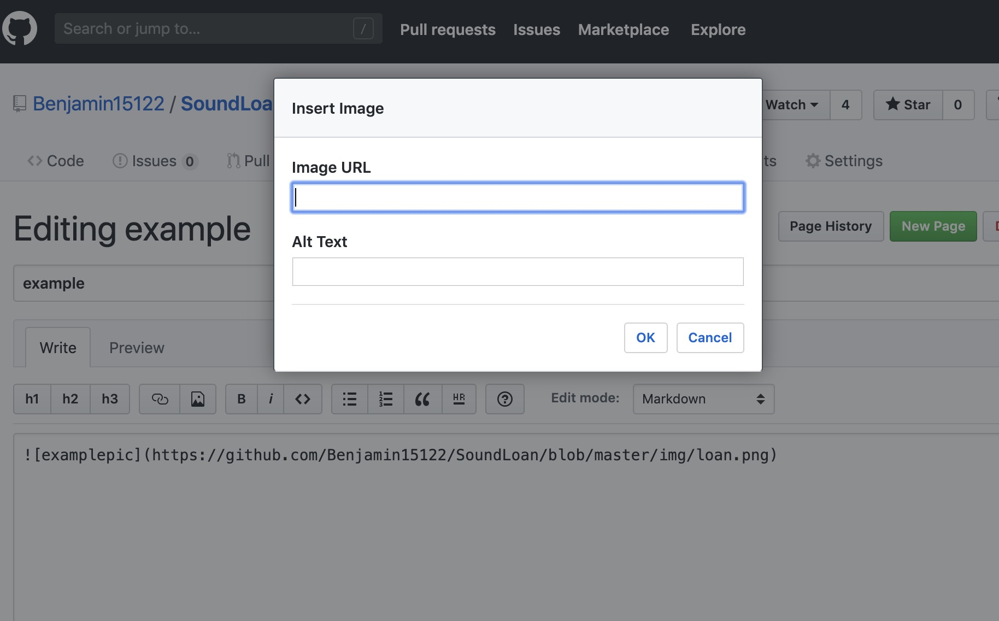

## 如何添加图片

#### 打开https://github.com/Benjamin15122/SoundLoan/

#### 打开img目录点击upload files按钮

#### 将文件拖拽到指定位置，在页面下方点选commit

#### 回到img文件夹，点击刚上传的图片，复制图片url

#### 在wiki的编辑页面，选择插入图片按钮（h3右侧第二个）

#### url复制粘贴到Image URL里，需要展示在文档的图片名写在Alt Text里（可不写）

